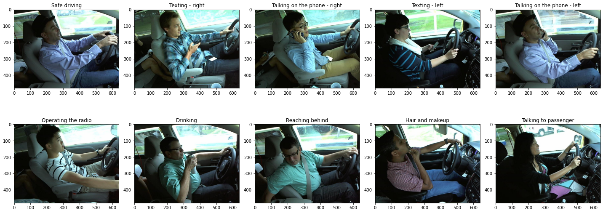

# Distracted Driver Detection

Distracted Driver Detection is a project aimed at enhancing road safety by using machine learning and computer vision techniques to detect distracted driving behaviors. This repository contains the code and documentation for the project.

## Introduction

Distracted driving is a significant concern as it can lead to accidents, injuries, and even fatalities. This project focuses on developing a solution to detect distracted drivers in real-time using advanced technologies like computer vision and machine learning.

## Dataset

The project uses a dataset from the State Farm Distracted Driver Detection Challenge on Kaggle. The dataset includes around 22,000 images, with a training set of around 17,000 images and a test set of around 5,000 images. Each image is labeled with one of 10 different types of distractions, such as texting, talking on the phone, or reaching behind.

## Related Work

In the related work section, we discuss the paper "Distracted Driver Recognizer with Simple and Efficient Convolutional Neural Network for Real-time System" by Duy-Linh Nguyen, Muhamad Dwisnanto Putro, and Kang-Hyun Jo. The paper explores a distracted driver recognition system based on an efficient Convolutional Neural Network (CNN).

## Methodology

The project's methodology involves data collection, data pre-processing, and model training. Data augmentation techniques are used to increase the diversity of the training data. The models include a custom CNN, VGG19, and EfficientNetB3. Transfer learning is applied using pre-trained models.

## Results and Analysis

The project's results show that transfer learning with models like VGG19 and EfficientNetB3 achieved high accuracy in detecting distracted drivers. The custom CNN model also performed well, demonstrating the effectiveness of the project's architecture and data preparation techniques.

## Conclusion

The Distracted Driver Detection project holds significant promise for improving road safety. The use of machine learning and transfer learning approaches allows for real-time detection of distracted driving behaviors. This project could lead to the development of driver distraction alert mechanisms that can prevent collisions and save lives on the road.

## Future Work

Future development could include integrating the distracted driver detection system with other driving assistance systems and further increasing the accuracy of the detection system.

## Contribution

- [Your Name]: Describe your contributions here.
- [Your Collaborator's Name]: Describe their contributions here.

## References

- [Paper 1 Title]: Link to the paper
- [Paper 2 Title]: Link to the paper
